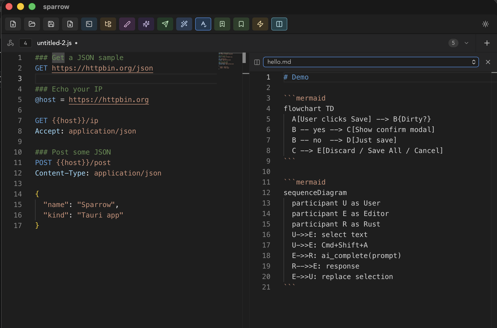
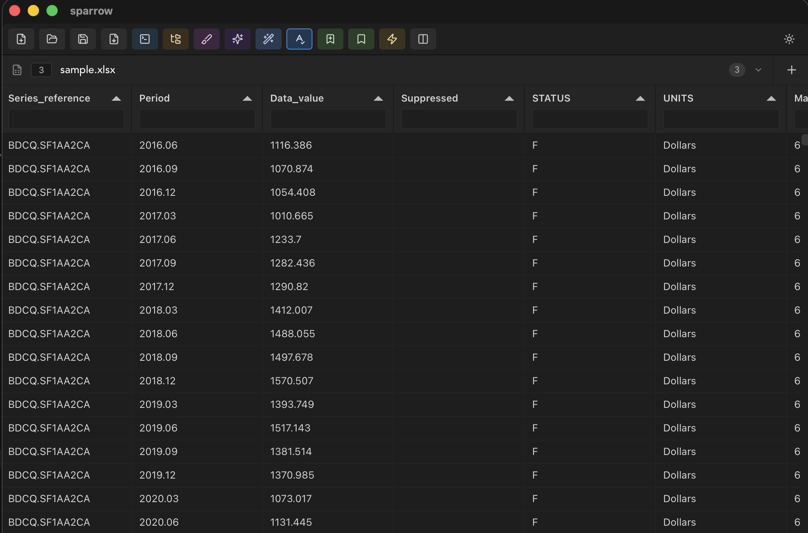
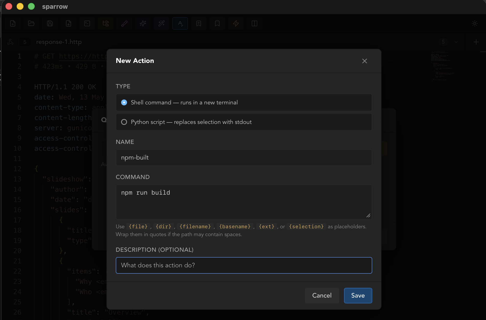
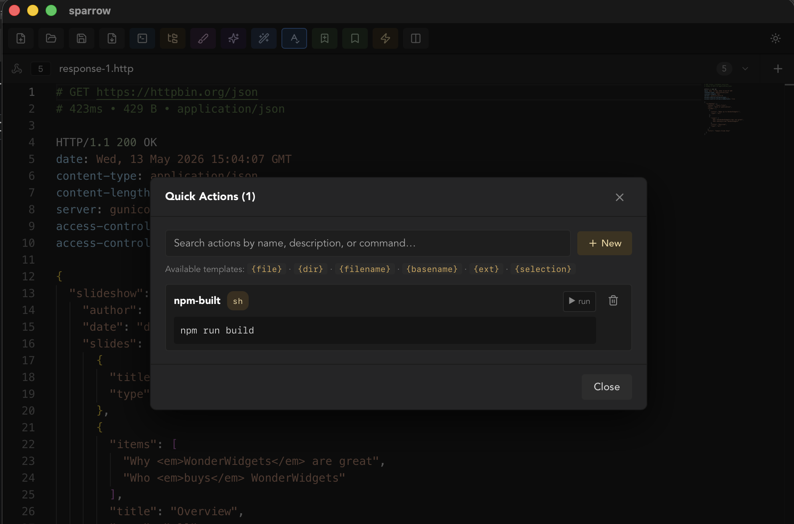
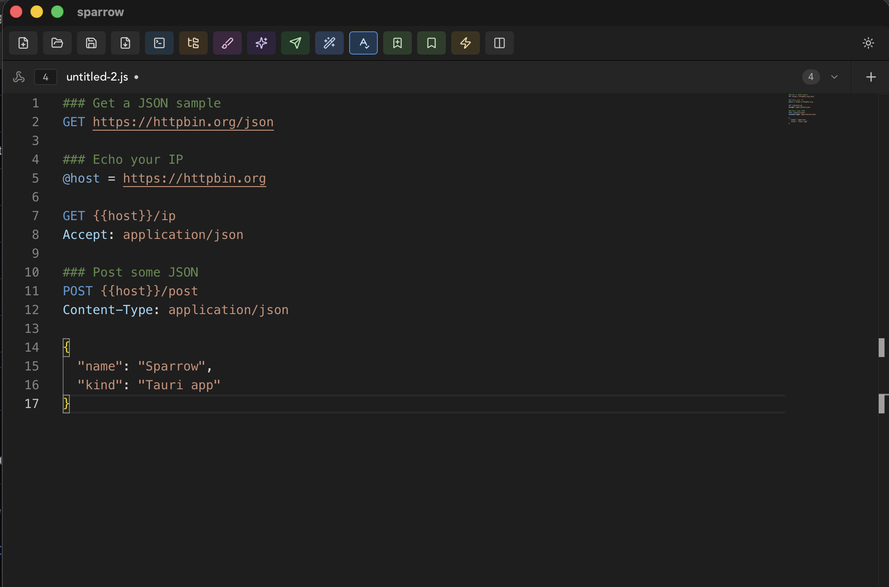
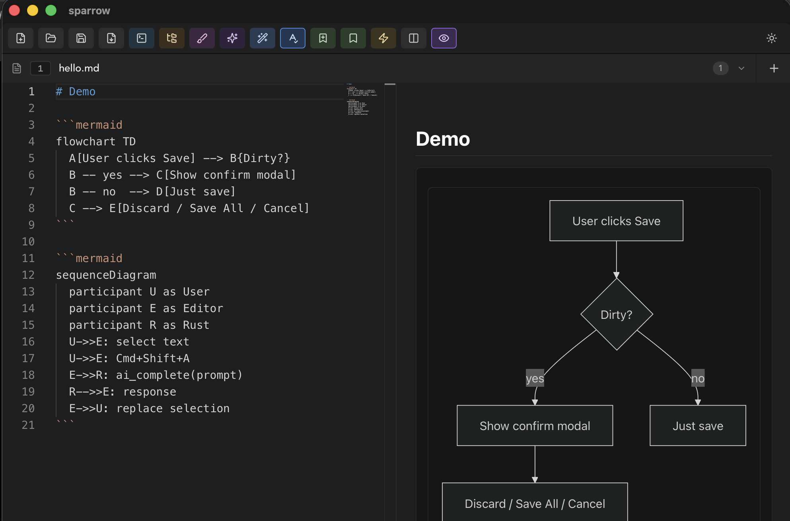
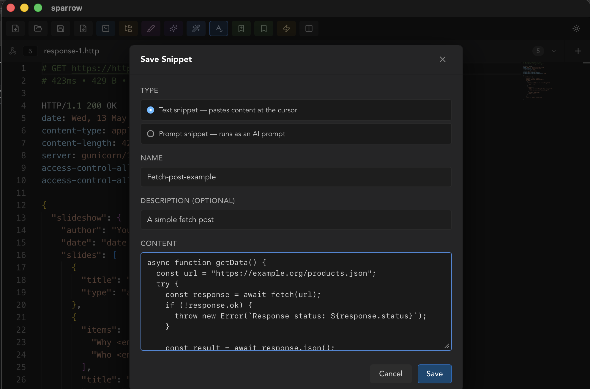
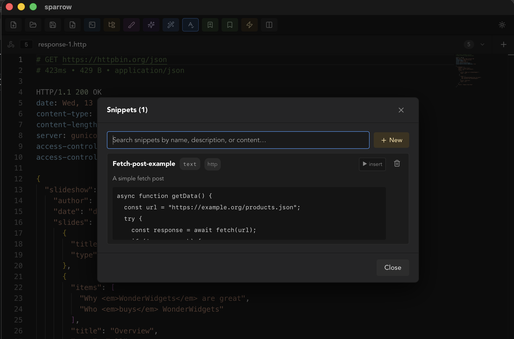

# Sparrow
 

A lightweight notepad built on Tauri + Vue + Monaco.

## Screenshots

### 2 Column layout

### Excel view

### Action

### Http

### MD view

### Snippet

## Features

**Editing**

- VS Code–style editor (Monaco) with syntax highlighting and code formatting
- Multi-tab UI with a type-and-search tab dropdown
- 2-column split view (compare two files side by side)
- Find, replace, go-to-line
- Spell check for `.md` and `.txt` (powered by CSpell)

**Files**

- File explorer with extension-aware icons
- Markdown live preview
- CSV / XLSX table editor (Tabulator)
- Image / SVG / PDF preview
- Whiteboard (`.sbw`) — free-hand drawing, shapes, text; export PNG / SVG / PDF

**Tools**

- Built-in terminals (PTY-backed via xterm.js)
- HTTP client for `.http` files (REST Client–compatible)
- Snippets — text snippets and **prompt snippets** that run through AI
- Quick Actions — saved shell commands or Python scripts with template variables (`{file}`, `{dir}`, `{selection}`, …)
- AI assist over a text selection (OpenAI or Anthropic)

## Keyboard shortcuts

Full table — files, tab navigation, editing, tools, dialogs — lives in
[`wiki/KEYBINDINGS.md`](wiki/KEYBINDINGS.md). Highlights:

- **New / Open / Save**: `Cmd/Ctrl + N` / `O` / `S`
- **Next / Previous tab** (wraps): `Ctrl + Tab` / `Ctrl + Shift + Tab` · also `Cmd/Ctrl + Alt + →` / `←`
- **Jump to tab N** (1 – 9): `Cmd/Ctrl + 1` … `Cmd/Ctrl + 9` — numbers are visible on the tabs themselves
- **Close tab** / **Quit**: `Cmd/Ctrl + W` / `Cmd/Ctrl + Q`
- **Find / Replace / Format Document**: `Cmd/Ctrl + F` / `Cmd/Ctrl + H` / `Shift + Alt + F`
- **Terminal / File Explorer / AI Assist**: `Cmd/Ctrl + T` / `Cmd/Ctrl + Shift + E` / `Cmd/Ctrl + Shift + A`

`Cmd/Ctrl` is **Cmd** on macOS, **Ctrl** on Windows / Linux.

## How to use

Walkthroughs for the three features that aren't fully obvious from the
toolbar — **Snippets**, **Quick Actions** (saved shell / Python tasks),
and **AI Assist** — live in [`wiki/USAGE.md`](wiki/USAGE.md). Quick
pointers:

- **Snippets**: bookmark+ icon saves the current selection; bookmark icon
  opens the library. Two flavors — **text** (pastes at cursor) and
  **prompt** (runs through AI on your selection).
- **Quick Actions**: Zap icon → + New. Two flavors — **shell** (runs in
  a new terminal) and **Python** (filters your selection through a `.py`
  script via stdin / stdout). Template vars: `{file}`, `{dir}`,
  `{filename}`, `{basename}`, `{ext}`, `{selection}`.
- **AI Assist**: configure once via **Tools → AI Settings…** (OpenAI or
  Anthropic key). Then select text and hit `Cmd/Ctrl + Shift + A`.

## Tech Stack

- Tauri
- Vue 3
- Monaco Editor
- xterm.js
- Tabulator
- Rust backend

## Note

This is a personal experimental project focused on fast iteration and developer productivity.
